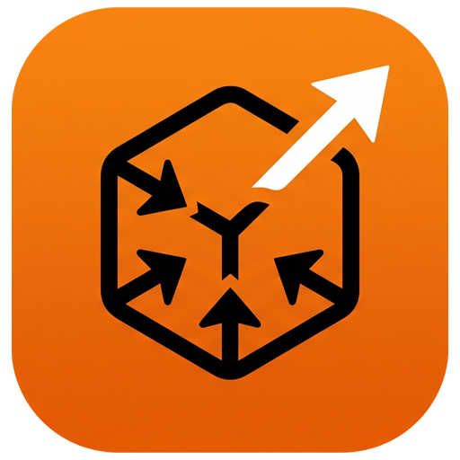

# Telepresence GUI

<div align="center">



### A modern, cross-platform desktop interface for [Telepresence](https://www.telepresence.io/).

Connect to Kubernetes clusters, inspect workloads, and manage live traffic intercepts without memorizing complex CLI commands.

[](https://github.com/mahdimomeni/telepresence-gui/releases/latest)
[](https://mahdimomeni.github.io/telepresence-gui/)
[](https://golang.org)
[](https://react.dev)
[](https://wails.io)
[](https://opensource.org/licenses/MIT)
[](https://mahdimomeni.github.io/telepresence-gui/download.html)

**[📖 Official Documentation](https://mahdimomeni.github.io/telepresence-gui/)** • **[📥 Download App](https://mahdimomeni.github.io/telepresence-gui/download.html)** • **[🚀 Quick Start](https://mahdimomeni.github.io/telepresence-gui/docs/getting-started/quick-start)** • **[✨ Features](#-key-features)** • **[💻 Developer Guide](#-local-development)**

</div>

---

## 📖 Overview

**Telepresence GUI** brings the power of [Telepresence](https://www.telepresence.io/) (a CNCF graduated project by Ambassador Labs) to a lightning-fast, intuitive desktop application. 

Instead of juggling lengthy CLI flags for CIDR blocks, port forwardings, authentication parameters, and environment exports, Telepresence GUI gives developers a visual workflow for local Kubernetes development. Connect to remote clusters, route traffic to local microservices or Docker containers, and test code live in seconds.

---

## ✨ Key Features

- 🌐 **High-Speed Cluster Discovery**: Instant in-memory YAML parsing of `~/.kube/config` and custom configs for sub-millisecond context and namespace extraction (with resilient `kubectl` CLI fallback). Supports manager namespace overrides, proxy subnets (`--also-proxy`, `--never-proxy`), Virtual NAT (`--vnat`), and user impersonation.
- 🎯 **Visual Workload Intercepts & Replacement**: Real-time table of cluster workloads. Intercept or replace traffic to local processes (`localhost:8080`) or Docker containers with HTTP header routing (`x-dev-user=mohammad`) and environment variable export (`.env`, Shell, JSON).
- 🛠️ **Automated System Dependency Checks**: Automated pre-flight validation on startup for `telepresence` (v2.x) and `kubectl` with live status reporting, detected paths/versions, and guided installation.
- ⚙️ **Comprehensive Application Settings**: Fine-tune themes (Dark/Light/System), ambient aurora glow effects, splash screen animations, close-to-tray/start-minimized behaviors, notification triggers, connectivity defaults, and log buffer preferences.
- 🪟 **Modern Frameless UI & Custom Title Bar**: Custom borderless window with integrated window controls, connection state pill, and native window dragging regions.
- 🖥️ **Native Desktop Integration**: Thread-safe system tray menu on Windows, macOS, and Linux with dynamic 1-click connect/disconnect toggles, live status polling, desktop notifications, and single-instance lock.
- 🔄 **Thread-Safe Auto Updates**: In-app updater checks for new GitHub Releases with atomic update protection and automatic platform/WebKit ABI matching (WebKit 4.1 & WebKit 4.0).
- ⚡ **Optimized Performance & Modern UI**: Zero-lag UI with React 19 component memoization (`React.memo`), TanStack Table v9 virtualization, bounded streaming logs, Vite code-splitting, and dark/light theme sync with Tailwind CSS v4 and shadcn/ui.

---

## 📥 Downloads & Installation

Pre-built binaries and native packages for all platforms are available on the [**Download Portal**](https://mahdimomeni.github.io/telepresence-gui/download.html) and [**GitHub Releases**](https://github.com/mahdimomeni/telepresence-gui/releases/latest).

| Platform | Supported Architectures | Packages |
| :--- | :--- | :--- |
| **Windows** | `x64 (amd64)`, `arm64` | Standalone Installer (`.exe`), Portable (`.zip`) |
| **macOS** | `Apple Silicon (arm64)`, `Intel (x64)`, `Universal` | App Bundle (`.tar.gz`) |
| **Linux (Ubuntu/Debian)** | `x64 (amd64)`, `arm64` | `.deb` (WebKit 4.1 & WebKit 4.0 builds), `.tar.gz` |
| **Linux (Fedora/RHEL)** | `x64 (amd64)`, `arm64` | `.rpm` (WebKit 4.1 & WebKit 4.0 builds) |
| **Linux (Alpine / Arch)** | `x64 (amd64)`, `arm64` | `.apk`, `.tar.gz` |

> [!NOTE]
> Ensure the **[Telepresence CLI (v2.x)](https://www.telepresence.io/docs/latest/install/)** and **Kubectl** are installed on your machine and available in your `PATH`.

---

## 📚 Documentation Portal

Comprehensive guides, architectural diagrams, and tutorials are hosted on our documentation site:

| Resource | Description |
| :--- | :--- |
| **[Getting Started & Intro](https://mahdimomeni.github.io/telepresence-gui/docs/intro)** | Project overview, core concepts, and prerequisite setup. |
| **[Quick Start Tutorial](https://mahdimomeni.github.io/telepresence-gui/docs/getting-started/quick-start)** | Connect to a cluster and create your first intercept in under 2 minutes. |
| **[Cluster Connection Guide](https://mahdimomeni.github.io/telepresence-gui/docs/user-guide/cluster-connection)** | Detailed guide for namespaces, subnets, RBAC proxies, and authentication. |
| **[Workload Intercepts & Replace](https://mahdimomeni.github.io/telepresence-gui/docs/user-guide/intercepts)** | Local processes, Docker container intercepts, headers, and `.env` exports. |
| **[Application Settings Guide](https://mahdimomeni.github.io/telepresence-gui/docs/user-guide/application-settings)** | Customizing themes, startup behavior, notification triggers, and connection defaults. |
| **[CLI Command Mapping](https://mahdimomeni.github.io/telepresence-gui/docs/reference/cli-mapping)** | Side-by-side mapping between Telepresence CLI commands and GUI actions. |
| **[Developer Setup](https://mahdimomeni.github.io/telepresence-gui/docs/developer-guide/development-setup)** | Building from source, Wails dev mode, and cross-platform compilation. |
| **[Troubleshooting & FAQ](https://mahdimomeni.github.io/telepresence-gui/docs/troubleshooting/faq)** | Solutions for common connection, permission, and WebKit issues. |

---

## 💻 Local Development

Telepresence GUI is built with **[Wails v2](https://wails.io)** (Go 1.25+ backend + React 19 frontend).

### Prerequisites
- [Go 1.25+](https://golang.org/dl/)
- [Node.js 20+](https://nodejs.org/) & `npm`
- [Wails CLI v2](https://wails.io/docs/gettingstarted/installation): `go install github.com/wailsapp/wails/v2/cmd/wails@latest`
- [Telepresence CLI](https://www.telepresence.io/docs/latest/install/) & [Kubectl](https://kubernetes.io/docs/tasks/tools/)

### Quick Start
```bash
# 1. Clone the repository
git clone https://github.com/mahdimomeni/telepresence-gui.git
cd telepresence-gui

# 2. Install frontend dependencies
cd frontend && npm install && cd ..

# 3. Start Wails live development mode (with hot reloading)
wails dev
```

### Compiling Production Binaries
```bash
# Compile standalone executable for your current OS
wails build

# Build Windows NSIS installer
wails build -nsis

# Build macOS Universal binary
wails build -platform darwin/universal
```

---

## 🧪 Testing & Validation Suite

Telepresence GUI includes a comprehensive test suite across the entire application stack:

### Frontend Tests (Unit, Integration & E2E)
```bash
cd frontend

# Run all unit and integration tests (Vitest)
npm run test

# Run full End-to-End (E2E) tests in browser (Playwright)
npm run test:e2e

# Run Playwright E2E tests with interactive UI
npm run test:e2e:ui

# Full validation pipeline (typecheck, lint, formatting, dead code, unit & integration tests)
npm run validate

# Dead code detection
npm run deadcode
```

### Backend Go Tests (Unit, Integration & E2E)
```bash
# Run all Go unit, integration, and E2E tests
go test -v ./...

# Run Go backend E2E lifecycle and resilience tests only
go test -v ./internal/e2e/...

# Run Go static analysis
go vet ./...
golangci-lint run ./...
```

---

## 🤝 Contributing

Contributions are always welcome! Whether reporting a bug, proposing a new feature, or submitting a pull request, please review our **[Contributing Guidelines](https://mahdimomeni.github.io/telepresence-gui/docs/contributing/guidelines)**.

```bash
git checkout -b feature/my-feature
git commit -m "feat: add my new feature"
git push origin feature/my-feature
```

---

## 📄 License

This project is licensed under the **MIT License** - see the [`LICENSE`](LICENSE) file for details.

---

## 👤 Author & Support

- **Author**: Mohammad Mahdi Momeni
- **Email**: [mahdimomeni012@gmail.com](mailto:mahdimomeni012@gmail.com)
- **GitHub**: [@mahdimomeni](https://github.com/mahdimomeni)
- **Documentation**: [https://mahdimomeni.github.io/telepresence-gui/](https://mahdimomeni.github.io/telepresence-gui/)

⭐ If you find Telepresence GUI helpful, consider giving it a star on [GitHub](https://github.com/mahdimomeni/telepresence-gui)!
