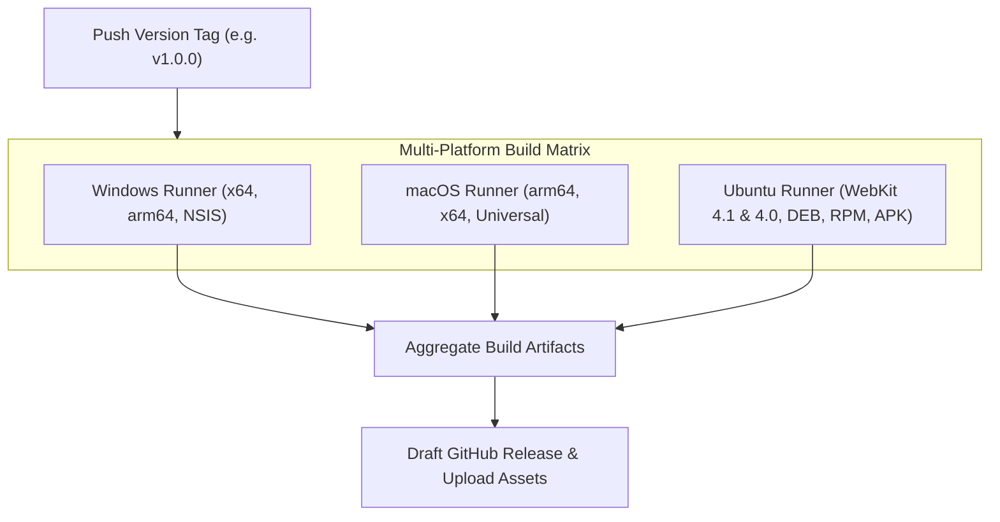

# CI/CD & GitHub Actions Automation

Telepresence GUI utilizes automated **GitHub Actions** workflows to compile, package, and publish release binaries across Windows, macOS, and Linux whenever a version tag (`v*.*.*`) is pushed.

## 🧪 Continuous Integration Workflow (`.github/workflows/ci.yml`)

Runs on every `push` and `pull_request` targeting `main`, `master`, and `dev` branches:

- **`backend-lint`**: Runs Go static analysis with `go vet` and `golangci-lint`.
- **`backend-test`**: Runs backend unit tests (`go test -v ./...`).
- **`frontend-lint`**: Type checks with TypeScript (`npm run typecheck`), checks code style with ESLint (`npm run lint`), verifies formatting with Prettier (`npm run format:check`), and detects dead code with Knip (`npm run deadcode`).
- **`frontend-test`**: Executes frontend unit and component integration tests with Vitest (`npm run test`).
- **`frontend-e2e`**: Runs end-to-end browser automation tests via Playwright (`npm run test:e2e`).

---

## 🚀 Release Workflow (`.github/workflows/release.yml`)



---

## 🛠️ Reusable Build Action (`.github/actions/build-wails/`)

The repository encapsulates Wails build logic into a custom reusable composite GitHub Action:
- Sets up Go and Node.js with caching.
- Installs platform Cgo headers (`libgtk-3-dev`, `libwebkit2gtk-4.1-dev`, `libayatana-appindicator3-dev`).
- Executes `wails build` with platform-specific flags.
- Packages output binaries into standardized `.zip` and `.tar.gz` archives with checksums.

---

## 🏷️ Publishing a New Release

To trigger an automated multi-platform release:

1. Update the version string in `wails.json` and `CHANGELOG.md`.
2. Commit your changes:
   ```bash
   git commit -am "chore: prepare release v1.1.0"
   ```
3. Create and push a Git tag:
   ```bash
   git tag v1.1.0
   git push origin v1.1.0
   ```
4. GitHub Actions will build all platform packages in parallel and publish the release to the GitHub Releases tab.
