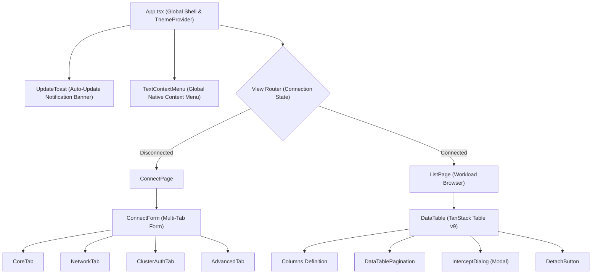

# Frontend Architecture & UI System

The Telepresence GUI frontend is built with **React 19**, **TypeScript**, **Vite**, **Tailwind CSS v4**, and **shadcn/ui**. It communicates with the Go backend asynchronously through Wails runtime bindings.

---

## 🎨 Tech Stack & Libraries

- **React 19 & TypeScript**: Provides modern state handling with strict typing.
- **Tailwind CSS v4 & shadcn/ui**: Accessible, customizable design primitives with native dark/light theme switching.
- **TanStack Table v9**: Virtualized, high-performance table engine handling workload filtering, multi-column sorting, and pagination.
- **Zustand**: Lightweight global state management for connection lifecycle and notification queues.
- **Lucide Icons**: Consistent, modern iconography.

---

## 🏗️ Component Architecture



---

## 📊 Workload Table (TanStack Table v9)

The workload table in `frontend/src/pages/list/data-table.tsx` uses TanStack Table v9:
- **Filtering**: Real-time text filtering applied to the `Name` column without re-rendering unnecessary DOM elements.
- **Sorting**: Multi-column sorting supporting alphabetical name ordering, namespace grouping, and replica count comparisons.
- **Pagination**: Client-side slicing preserving responsiveness across clusters with hundreds of workloads.

---

## 🌉 Wails IPC & JavaScript Runtime Bindings

Wails automatically parses Go struct methods in `internal/app/app.go` and generates TypeScript functions and type declarations in `frontend/src/wailsjs/`:

```typescript
// Invoking Go backend from React:
import { StartTelepresence, ListWorkloads, InterceptWorkload } from '@/wailsjs/go/app/App';
import { models } from '@/wailsjs/go/models';

// Establish connection:
await StartTelepresence(connectConfig);

// Query workloads:
const workloads: models.Workload[] = await ListWorkloads();

// Start intercept:
await InterceptWorkload(interceptConfig);
```

### Event Listeners (Wails Runtime)
```typescript
import { EventsOn, EventsOff } from '@/wailsjs/runtime/runtime';

useEffect(() => {
  // Listen for daemon status changes from the Go background watcher
  const unsubStatus = EventsOn('status:update', (status) => {
    setDaemonStatus(status);
  });

  // Listen for live daemon logs
  const unsubLogs = EventsOn('daemon-log', (logMessage) => {
    appendLog(logMessage);
  });

  return () => {
    EventsOff('status:update');
    EventsOff('daemon-log');
  };
}, []);
```
