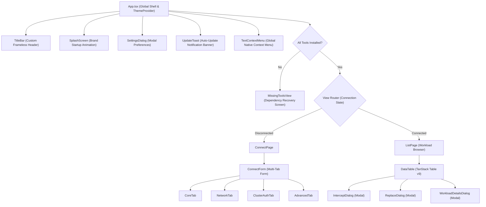

# Frontend Architecture & UI System

The Telepresence GUI frontend is built with **React 19**, **TypeScript**, **Vite**, **Tailwind CSS v4**, and **shadcn/ui**. It communicates with the Go backend asynchronously through Wails runtime bindings.

---

## 🎨 Tech Stack & Libraries

- **React 19 & TypeScript**: Provides modern state handling with strict typing.
- **Tailwind CSS v4 & shadcn/ui**: Accessible, customizable design primitives with native dark/light theme switching.
- **TanStack Table v9**: Virtualized, high-performance table engine handling workload filtering, multi-column sorting, and pagination.
- **Zustand Stores**: Lightweight global state management for connection lifecycle (`useConnectionStore`), application preferences (`useSettingsStore`), tool dependency health (`useToolsStore`), and action loaders (`useLoadingStore`).
- **Lucide Icons**: Consistent, modern iconography.
- **Vitest & Playwright**: Comprehensive unit, integration, and E2E test suites.

---

## 🏗️ Component Architecture



---

## ⚡ Performance Optimizations & State Management

To deliver 60 FPS responsiveness when managing hundreds of workloads or streaming high-velocity daemon logs, the frontend implements several optimization strategies:

### 1. Form Tab Memoization (`React.memo`)
The multi-tab connection configuration form separates tab panes (`CoreTab`, `NetworkTab`, `ClusterAuthTab`, `AdvancedTab`) into dedicated components memoized with `React.memo`. State mutations inside one tab do not trigger re-renders of other tabs.

### 2. Table & Callback Stabilization
- **Memoized DataTable**: `DataTable` is wrapped with `React.memo` and uses stabilized input filtering callbacks (`handleFilterChange`).
- **Hook Optimization in ListPage**: Workload fetchers (`fetchWorkloads`), disconnection handlers (`handleDisconnect`), intercept dialog toggles, and column definitions (`columns`) are stabilized via `useCallback` and `useMemo` to eliminate unnecessary DOM recalculations on background updates.

### 3. Bounded Log Stream & Smooth Auto-Scroll
The daemon log viewer (`frontend/src/components/log-panel.tsx`) prevents browser memory degradation during long-running sessions:
- **Ring Buffer Capping**: Restricts log storage to configurable `maxLogLines` (default: 2000 entries) using `.slice(-maxLogLines)`.
- **AnimationFrame Scroll**: Dispatches scroll position adjustments via `requestAnimationFrame` when the log drawer is open, preventing UI layout thrashing.

### 4. Vite Bundle Code Splitting
The production Vite build (`frontend/vite.config.ts`) defines explicit Rollup chunk boundaries to optimize caching and reduce main thread parsing time:
- `vendor-react`: `react`, `react-dom`
- `vendor-ui`: `@base-ui/react`, `clsx`, `tailwind-merge`, `class-variance-authority`
- `vendor-table`: `@tanstack/react-table`
- `vendor-icons`: `lucide-react`

---

## 📊 Workload Table (TanStack Table v9)

The workload table in `frontend/src/pages/list/data-table.tsx` uses TanStack Table v9:
- **Filtering**: Real-time text filtering applied to the `Name` column without re-rendering unnecessary DOM elements.
- **Sorting**: Multi-column sorting supporting alphabetical name ordering, namespace grouping, and replica count comparisons.
- **Pagination**: Client-side slicing preserving responsiveness across clusters with hundreds of workloads.

---

## 🌉 Wails IPC & JavaScript Runtime Bindings

Wails automatically parses Go struct methods in `internal/app/app.go` and generates TypeScript functions and type declarations in `frontend/src/wailsjs/`:

```typescript
// Invoking Go backend from React:
import { StartTelepresence, ListWorkloads, InterceptWorkload, ReplaceWorkload, GetAppSettings } from '@/wailsjs/go/app/App';
import { models } from '@/wailsjs/go/models';

// Establish connection:
await StartTelepresence(connectConfig);

// Query workloads:
const workloads: models.Workload[] = await ListWorkloads();

// Intercept or replace workload:
await InterceptWorkload(interceptConfig);
await ReplaceWorkload(replaceConfig);
```
