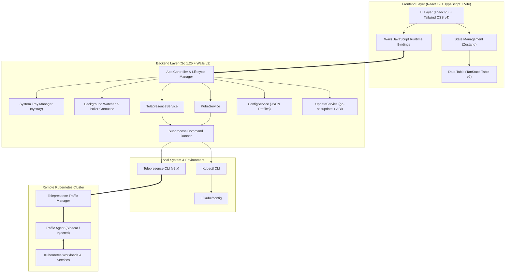
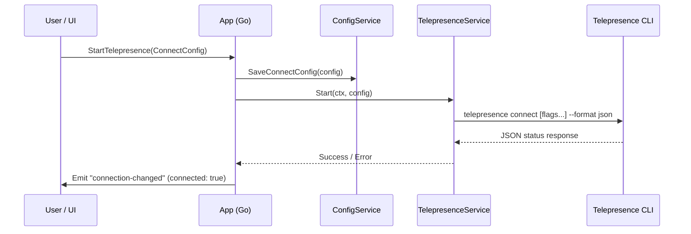
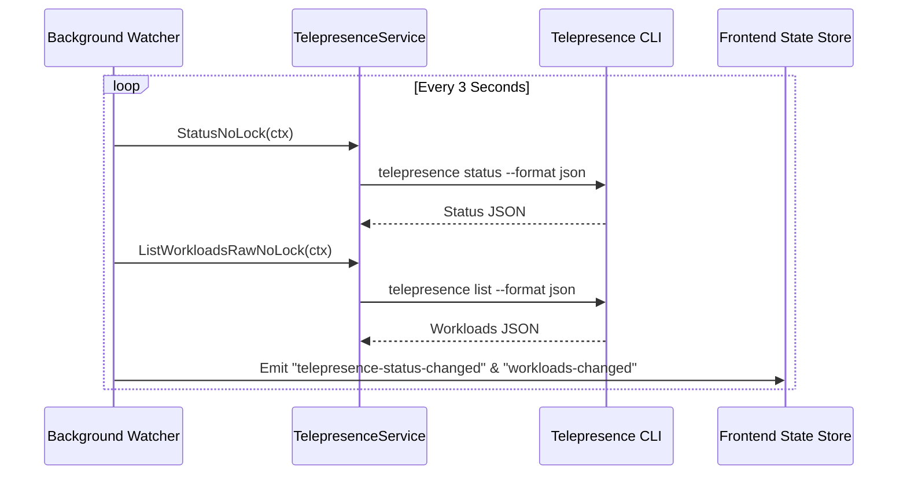

# Architecture & Core Concepts

Telepresence GUI is engineered using **Wails v2**, combining a high-performance **Go** backend with a responsive **React 19** frontend. It acts as an orchestration layer on top of the native **Telepresence CLI** and **Kubectl** binaries, providing desktop integration, process lifecycle management, and real-time state synchronization.

---

## 🏗️ High-Level System Architecture

---

## 🧩 Architectural Components

### 1. Presentation Layer (Frontend)
- **React 19 & TypeScript**: High-performance UI rendering with modern hooks and strict typing.
- **Tailwind CSS v4 & shadcn/ui**: Modern design system supporting dark/light modes, accessible modal dialogs, context menus, and custom scrollbars.
- **TanStack Table v9**: Virtualized, column-sortable, searchable, and paginated table engine capable of rendering hundreds of workloads smoothly.
- **Zustand State Stores**: Lightweight state container managing global connection states, notification queues, and active intercept metadata.
- **Wails JS Bindings**: Automatically generated TypeScript declarations bridging Go struct definitions and methods directly to browser JavaScript.

### 2. Application Layer (Go Backend)
- **App Controller (`internal/app/app.go`)**: Manages the application lifecycle, centralized connection state transitions (`updateConnectionStatus`), IPC communication with the frontend, desktop notifications, file dialogs, and single-instance locks.
- **Background Watcher (`internal/app/watcher.go`)**: A dedicated background goroutine that polls `telepresence status` and `telepresence list` every 3 seconds, detecting daemon crashes or out-of-band CLI changes and emitting event updates (`telepresence-status-changed`, `workloads-changed`, `connection-changed`) to the frontend.
- **System Tray (`internal/app/tray_*.go`)**: OS-native system tray integration (Windows, macOS, Linux) enabling dynamic status labels (`Connect`/`Disconnect`), quick status checks, and 1-click connect/disconnect actions when the main window is minimized or closed.
- **Subprocess Runner (`internal/cli/runner.go`)**: Cross-platform execution engine with timeout contexts, JSON output parsing, and error sanitization.

### 3. Core Services (`internal/services/`)
- **`TelepresenceService`**: Manages daemon lifecycle (`telepresence connect`, `quit -s`), workload queries (`telepresence list --format json`), intercept creation (`telepresence intercept`), and detach commands (`telepresence detach`). Supports raw JSON caching for efficient delta detection.
- **`KubeService`**: Features a high-speed in-memory YAML parser (`gopkg.in/yaml.v3`) to parse `~/.kube/config` and custom kubeconfig files in sub-millisecond time, with fallback to `kubectl config get-contexts` / `kubectl get namespaces`.
- **`ConfigService`**: Thread-safe configuration persistence (`sync.RWMutex`) storing user profiles in the OS config directory (`%APPDATA%/telepresence-gui/config.json` on Windows, `~/.config/telepresence-gui/config.json` on Linux/macOS).
- **`UpdateService`**: Thread-safe self-update engine (`sync.Mutex` with atomic state guard) checking GitHub Releases, matching Linux WebKit ABI tags (`webkit41` vs `webkit40`), downloading assets, applying in-place patches, and restarting the process.

---

## 🔄 Data & Communication Flow

### 1. Connection Initialization Flow

### 2. Workload Polling & Intercept Flow

---

## 🔒 Security & Single Instance Architecture

- **Single Instance Lock**: Telepresence GUI registers a unique system GUID (`ca6a3d2a-9307-43ee-9fc3-dff845cb175a`). Attempting to launch a second instance automatically focuses the existing window and passes CLI arguments without spawning duplicate daemons.
- **Subprocess Isolation**: Telepresence CLI commands are executed via dedicated `os/exec` contexts with timeouts (60 seconds default) preventing zombie processes and deadlocks.
- **Privilege Separation**: Elevated network operations (DNS modification, TUN/TAP driver routing) are handled by the Telepresence root daemon, while GUI operations run completely in user space without requiring root privileges for the application itself.
