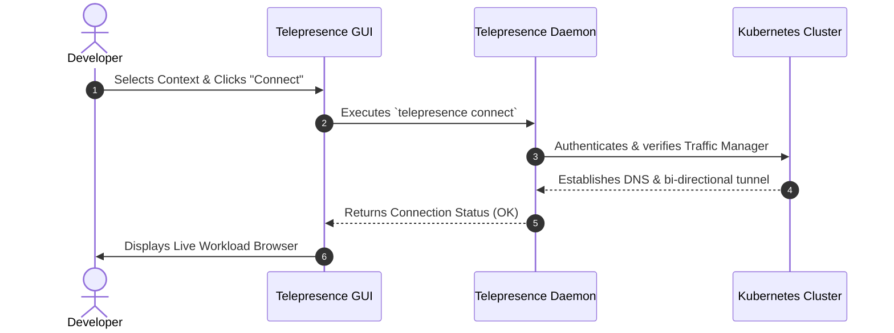
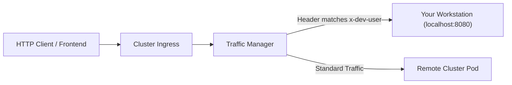

# 5-Minute Quickstart

This guide walks you through connecting Telepresence GUI to a Kubernetes cluster and creating your first traffic intercept in under 5 minutes.

---

## Step 1: Launch Telepresence GUI

Open **Telepresence GUI** from your applications menu or terminal:

```bash
telepresence-gui
```

Upon launch, the application reads your default `~/.kube/config` and displays the **Connect Screen**.

---

## Step 2: Configure Your Connection

On the **Core** and **Cluster & Auth** tabs:

1. **Kubeconfig Context**: Select your target cluster context from the dropdown menu (or click **Browse** to specify a custom kubeconfig file).
2. **Namespace**: Specify the Kubernetes namespace you want to work in (e.g., `default`, `staging`, or `dev`).
3. **Manager Namespace** *(Optional)*: If your cluster traffic manager is installed in a non-standard namespace (such as `ambassador`), enter it here.



Click **Connect**. Telepresence GUI will initialize the root and user daemons, set up virtual network adapters, and transition to the **Workload Browser**.

---

## Step 3: Browse Cluster Workloads

Once connected, you will see a real-time list of all available workloads (Deployments, StatefulSets, Rollouts) in your selected namespace:

| Workload Name | Namespace | Kind | Replicas | Status | Action |
| :--- | :--- | :--- | :--- | :--- | :--- |
| `auth-service` | `dev` | Deployment | 2/2 | Ready | [ Intercept ] |
| `payment-api` | `dev` | Deployment | 1/1 | Ready | [ Intercept ] |
| `order-worker` | `dev` | Deployment | 3/3 | Ready | [ Intercept ] |

Use the top search bar to filter workloads by name, or use the pagination controls to browse large namespaces.

---

## Step 4: Create a Traffic Intercept

1. Locate the workload you want to develop on (e.g., `auth-service`) and click the **Intercept** button on its row.
2. In the **Intercept Configuration Dialog**:
   - **Local Port**: Enter the port where your local service or IDE debugger is running (e.g., `8080` or `3000:80`).
   - **HTTP Header Routing** *(Recommended for shared clusters)*: Enter `x-dev-user=myname`. Only HTTP requests carrying this header will route to your machine; all regular traffic continues to hit the live cluster pod.
   - **Export Environment**: Choose `.env` (Docker format) to download cluster secrets, config maps, and environment variables to a local file.
3. Click **Start Intercept**.



---

## Step 5: Test & Debug Locally

1. Start your local development server or debugger in VS Code / GoLand / IntelliJ listening on the configured port (`8080`).
2. Send a request to your cluster service or ingress with the header `x-dev-user: myname`:
   ```bash
   curl -H "x-dev-user: myname" https://dev.example.com/auth/login
   ```
3. Your local breakpoint will trigger! You can inspect request payloads, modify code with live reload, and query cluster-internal databases directly.

---

## Step 6: Release the Intercept & Disconnect

When you finish your development session:

1. Click the **Detach** button on the workload row in Telepresence GUI to restore normal cluster traffic routing.
2. Click **Disconnect** in the top navigation bar or right-click the system tray icon and select **Disconnect**.

🎉 **Congratulations!** You have successfully completed your first local development cycle using Telepresence GUI.
