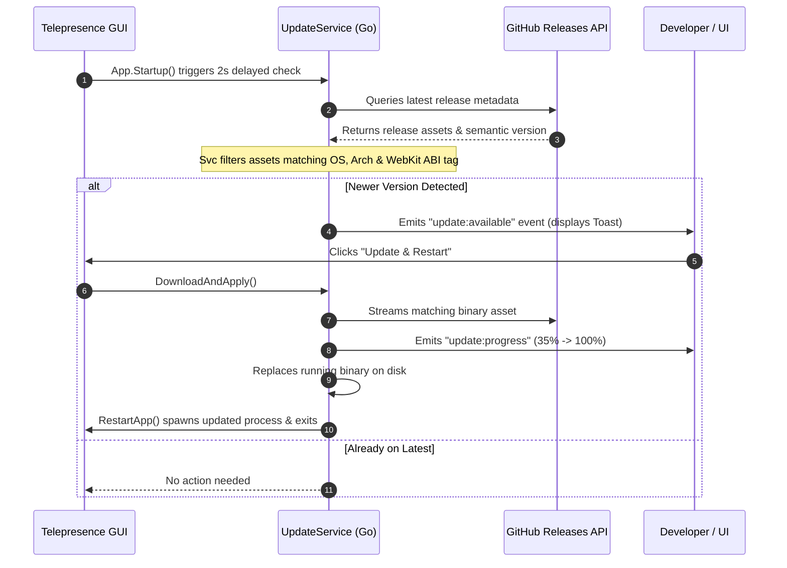

# In-App Auto Updates

Telepresence GUI features an intelligent, native auto-update engine powered by `go-selfupdate` and the GitHub Releases API. It ensures your desktop application stays up-to-date with bug fixes, Kubernetes compatibility improvements, and performance enhancements without requiring manual reinstallation.

---

## ⚡ How Auto-Updates Work



---

## 🔍 ABI & Architecture Matching

The update engine automatically queries the runtime environment and selects the exact asset built for your system:

- **OS**: `windows`, `darwin` (macOS), or `linux`.
- **Architecture**: `amd64` (x86_64) or `arm64` (aarch64 / Apple Silicon).
- **Linux ABI Tag**: If running a WebKit 4.0 build, the updater automatically selects the `_webkit40` asset; on modern distributions, it downloads the default WebKit 4.1 asset.

---

## 🔔 Update User Experience

### 1. Update Toast Banner
When an update is detected, a non-intrusive toast banner appears in the top-right corner of the application:

```
+-------------------------------------------------------------+
| 🚀 Update Available: v1.1.0                                  |
| A new version of Telepresence GUI is ready to install.      |
| [ Release Notes ]                 [ Update & Restart ]      |
+-------------------------------------------------------------+
```

### 2. Live Progress Indicator
Clicking **Update & Restart** opens a progress bar showing live download and installation status:
- `Checking release asset... (10%)`
- `Downloading package... (35%)`
- `Applying binary patch... (80%)`
- `Update complete! Restarting... (100%)`

### 3. In-Place Process Replacement & Concurrency Safety
- **Atomic Concurrency Guard**: An internal `isUpdating` mutex guard ensures that update downloads cannot be triggered multiple times concurrently.
- **Non-Blocking Operations**: Mutex locks are released prior to initiating network downloads and patching, keeping the application interface responsive throughout the update process.
- **Seamless Process Swap**: The application safely swaps the on-disk binary, launches the new executable with your existing arguments, and terminates the previous process without disrupting your system.

---

## ⚙️ Manual Update Check

You can also trigger an update check manually at any time by clicking **Check for Updates** in the application settings or system tray menu.
