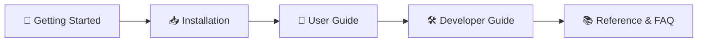

# Welcome to Telepresence GUI

  
  
<strong>A modern, cross-platform graphical user interface for Telepresence and Kubernetes local development.</strong>

---

## 🎯 What is Telepresence GUI?

**Telepresence GUI** is a native, cross-platform desktop application designed to eliminate the friction of developing microservices on Kubernetes. Built on top of [Telepresence](https://www.telepresence.io/) (a Cloud Native Computing Foundation graduated tool by Ambassador Labs), Telepresence GUI replaces convoluted terminal flags, lengthy network routing arguments, and manual context switching with a responsive visual control plane.

With Telepresence GUI, you can connect your workstation directly into a remote Kubernetes cluster, browse live workloads in real time, route traffic to your local IDE or Docker containers, and test your code against live upstream services without deploying container images.

---

## 💡 Why Use Telepresence GUI?

Developing microservices inside Kubernetes often requires choosing between two extremes:
1. **Running everything locally** (via Minikube, Kind, or Docker Compose): Consumes massive CPU/RAM, requires mock databases and cloud services, and quickly becomes unmaintainable as architecture grows.
2. **Push-to-test CI/CD cycles**: Building Docker images, pushing to container registries, and waiting for Kubernetes rolling updates for every single line of code change (taking 5–15 minutes per iteration).

**Telepresence bridges this gap** by establishing a bi-directional proxy between your local machine and the remote Kubernetes cluster.

### CLI vs. GUI Comparison

| Feature / Workflow | Official Telepresence CLI | Telepresence GUI |
| :--- | :--- | :--- |
| **Cluster Connection** | Requires memorizing 15+ flags (`--also-proxy`, `--mapped-namespaces`, `--as`, `--vnat`, etc.) | Multi-tab intuitive visual form with auto-completion and validation |
| **Context & Namespace Discovery** | Manual shell typing or separate `kubectl config` queries | Automatic discovery from `~/.kube/config` with searchable dropdowns |
| **Profile Persistence** | Manual shell aliases or bash scripts | Automatic profile persistence; 1-click reconnection across restarts |
| **Workload Inspection** | Plain text terminal output requiring regex or grep | Real-time TanStack table with column sorting, live filtering, and pagination |
| **Intercept Configuration** | Complex CLI syntax with multiple sub-commands and flags | Step-by-step modal supporting local ports, Docker containers, and headers |
| **HTTP Header Routing** | Easy to mistype header pairs in CLI strings | Key-value UI table with preview |
| **Environment Variable Export** | Manual flags (`--env-file`, `--env-json`, `--env-syntax`) | 1-click export to `.env` (Docker format), Shell (`sh`), or JSON |
| **Background Management** | Terminal window must remain open or run background daemons manually | Runs in system tray with native notifications and status indicators |
| **Software Updates** | Manual binary downloads and package manager updates | Built-in self-updater with ABI detection and 1-click in-place patching |

---

## 🌟 Key Highlights

- **🌐 Comprehensive Connection Manager**: Seamlessly configure namespaces, manager namespaces, CIDR proxying (`--also-proxy`, `--never-proxy`), Virtual NAT (`--vnat`), local/remote port redirects, and RBAC impersonation.
- **🎯 1-Click Workload Intercepts**: Route traffic from any deployment or statefulset to your local debugger (`localhost:8080`) or local Docker container.
- **🔀 Multi-Developer Header Routing**: Share staging clusters safely by routing only requests matching custom headers (e.g., `x-developer: mohammad`) to your machine while other team members use standard cluster traffic.
- **🖥️ Native System Tray**: Minimize to tray on Windows, macOS, and Linux; quickly inspect daemon state, reconnect, or disconnect with a single click.
- **⚡ High Performance & Low Resource Footprint**: Built with Go 1.25 and Wails v2, Telepresence GUI starts in milliseconds and consumes minimal RAM compared to Electron apps.
- **🎨 Dark & Light Modes**: Full theming support with automatic OS synchronization powered by Tailwind CSS v4 and shadcn/ui.

---

## 🗺️ Documentation Roadmap

Explore the sections below to get the most out of Telepresence GUI:

- **[5-Minute Quickstart](./getting-started/quick-start.md)**: Connect to your first cluster and intercept a service in under 5 minutes.
- **[Architecture & Core Concepts](./getting-started/architecture.md)**: Learn how Wails, Go services, and the Kubernetes Traffic Manager interact.
- **[Installation Matrix](./installation/overview.md)**: Download pre-built packages for Windows, macOS, and Linux.
- **[User Guide](./user-guide/cluster-connection.md)**: Comprehensive guide on connection settings, network routing, and intercepts.
- **[Developer Guide](./developer-guide/development-setup.md)**: Set up your local environment and contribute to the project.
