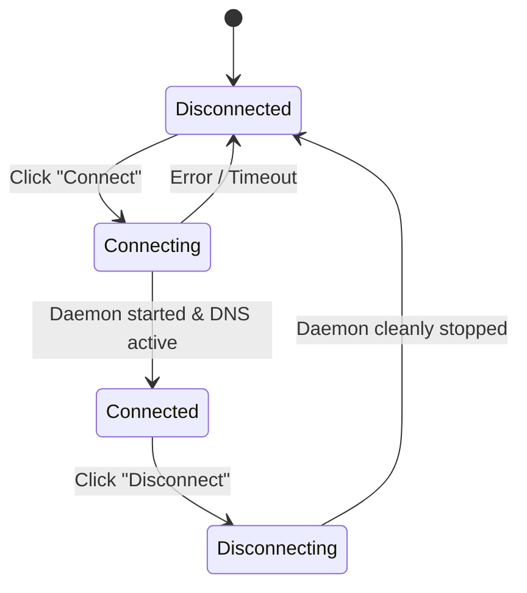

# Connecting to Kubernetes Clusters

The **Cluster Connection** interface is the central hub for establishing secure, bi-directional proxy connections to your Kubernetes environments. Telepresence GUI organizes connection settings across four structured tabs: **Core**, **Network**, **Cluster & Auth**, and **Advanced**.

---

## 🎛️ Core Connection Settings

The **Core** tab provides immediate access to essential session settings:

```
+-------------------------------------------------------------+
| Namespace:          [ dev                     ]             |
| Connection Name:    [ my-feature-session      ]             |
| Manager Namespace:  [ ambassador              ]             |
| Docker Daemon:      [ ] Run Daemon in Docker                |
+-------------------------------------------------------------+
```

### 1. Target Namespace (`--namespace`)
Specifies the Kubernetes namespace where your services and workloads reside. 
- Automatically populated based on the default namespace of your selected `kubeconfig` context.
- Can be overridden at any time.

### 2. Connection Name (`--name`)
An optional custom identifier for your connection.
- Useful when connecting to multiple clusters or running parallel sessions.
- Displays in status reports and log outputs.

### 3. Manager Namespace (`--manager-namespace`)
Specifies the namespace where the Telepresence Traffic Manager is deployed.
- By default, Telepresence installs its manager in `ambassador` or `telepresence`.
- If your cluster administrator installed the manager in a custom namespace, specify it here.

### 4. Docker Daemon (`--docker`)
When enabled, Telepresence GUI runs the user daemon inside a local Docker container instead of running directly on the host OS.
- Useful in restricted environments where local TUN/TAP network drivers are restricted.

---

## 📁 Automatic Kubeconfig Discovery

Telepresence GUI inspects your default Kubernetes configuration file (`~/.kube/config` on macOS/Linux, `%USERPROFILE%\.kube\config` on Windows) on startup:

1. **Context Dropdown**: Lists all configured contexts.
2. **Cluster & Server**: Automatically resolves cluster endpoint URLs.
3. **Custom Kubeconfig Browser**: Click the **Browse** button to select an alternate kubeconfig file anywhere on your filesystem.

---

## 💾 Profile Persistence & 1-Click Restore

Every time you modify connection fields and click **Connect**, Telepresence GUI automatically serializes your entire configuration into `config.json` in your user config directory:
- **Windows**: `%APPDATA%\telepresence-gui\config.json`
- **macOS / Linux**: `~/.config/telepresence-gui/config.json`

When you reopen Telepresence GUI, all settings, namespaces, proxy CIDRs, and authentication parameters are instantly restored, allowing **1-click reconnections**.

---

## 🔌 Connection Lifecycle



1. **Click Connect**: Telepresence GUI spawns the daemon subprocess with all configured arguments.
2. **Live Daemon Log**: If any error occurs (such as cluster unreachable, expired bearer token, or permission denied), the **Live Log Drawer** automatically surfaces the detailed output from Telepresence.
3. **Transition to Dashboard**: Upon successful connection, the interface automatically navigates to the **Workload Browser**.
