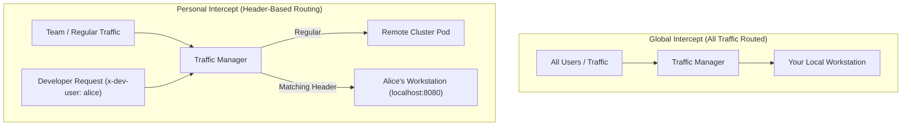

# Traffic Intercepts & Workload Replacement

A **Traffic Intercept** is the core capability of Telepresence. It instructs the Kubernetes Traffic Manager to reroute inbound traffic destined for a remote workload directly to your local development machine or a local Docker container.

---

## 🎯 Global vs. Personal (Header-Based) Intercepts



- **Global Intercept**: Captures 100% of the traffic hitting the Kubernetes service and sends it to your machine. Suitable for dedicated sandbox/dev clusters.
- **Personal (Header-Based) Intercept**: Uses HTTP request header matching (e.g. `x-dev-user=alice` or `authorization: Bearer token`). Only requests containing the specified header are routed to your machine, allowing multiple team members to share the same staging cluster simultaneously without collisions!

---

## 🔄 Intercept vs. Workload Replacement

Telepresence GUI supports two distinct interception paradigms:

1. **Traffic Intercept (`telepresence intercept`)**: Keeps the remote Kubernetes pod running while inserting a lightweight sidecar proxy (traffic-agent) to dynamically reroute inbound requests.
2. **Workload Replacement (`telepresence replace`)**: Swaps out the remote pod's main container completely with a dedicated proxy, effectively redirecting all inbound connections while eliminating remote CPU/RAM resource usage.

---

## 🛠️ Configuring an Intercept in Telepresence GUI

Clicking **Intercept** or **Replace** on any workload opens the configuration modal:

```
+--------------------------------------------------------------------+
| Intercepting Workload: auth-service                                 |
+--------------------------------------------------------------------+
| Target Local Port:    [ 8080                             ]          |
|                                                                    |
| [X] HTTP Header Route: [ x-dev-user=alice                 ]          |
|                                                                    |
| Environment Export:                                                |
|   (•) .env (Docker)    ( ) Shell Script (.sh)   ( ) JSON           |
|   Export File Path:   [ /home/alice/projects/auth/.env   ] [Browse] |
|                                                                    |
| Execution Mode:                                                    |
|   (•) Local Process    ( ) Docker Container                        |
|                                                                    |
| Advanced Settings (Optional):                                      |
|   Target Container:   [ auth-container                   ]          |
|   Target Service:     [ auth-service-http                ]          |
|   Mount Directory:    [ /tmp/k8s-mounts/auth             ]          |
+--------------------------------------------------------------------+
|                                [ Cancel ]   [ Start Intercept ]    |
+--------------------------------------------------------------------+
```

---

## ⚙️ Configuration Options

### 1. Target Local Port (`--port`)
Specifies where your local code is listening:
- `8080`: Routes traffic to `127.0.0.1:8080`.
- `3000:80`: Maps cluster service port `80` to local workstation port `3000`.

### 2. HTTP Header Matching (`--http-header`)
- Enter key-value pairs in the format `Key=Value` (e.g., `x-developer=mohammad` or `x-feature-flag=beta-test`).
- Telepresence injects Envoy filter rules into the traffic agent to evaluate incoming HTTP/1.1 and HTTP/2 headers.

### 3. Environment Variable Export
When Telepresence intercepts a workload, it retrieves all Kubernetes `ConfigMap` values, `Secret` keys, and downward API environment variables defined in the pod specification.
- **`.env` (Docker format)**: Creates standard key-value `.env` files compatible with Vite, Next.js, Dotenv, and Docker.
- **Shell Script (`.sh`)**: Creates an executable export script (e.g. `export DB_HOST=...`).
- **JSON Format**: Creates a structured JSON object (`--env-json`).

### 4. Docker Container Intercepts (`--docker-run`)
Instead of running code directly on your host OS, you can launch a local Docker container that automatically inherits the cluster's network and environment variables:
- Toggle **Docker Container Mode**.
- Pass custom Docker run arguments:
  ```bash
  -v $(pwd):/app -w /app node:20-alpine npm run dev
  ```

### 5. Advanced Pod & Mount Settings
- **Target Container (`--container`)**: In multi-container pods, specifies which container's ports and environment should be intercepted.
- **Target Service (`--service`)**: In workloads exposed by multiple Kubernetes services, specifies which service to intercept.
- **Mount Directory (`--mount`)**: Telepresence can mount remote pod volumes (PVCs, config files, service account tokens) to a local directory via FUSE/SFTP.

---

## 🛑 Releasing an Intercept

To end an intercept or replacement session:
1. Locate the intercepted workload in the table.
2. Click **Detach**.
3. Telepresence GUI immediately instructs the traffic manager to remove the Envoy routing rules and restore standard pod traffic.
