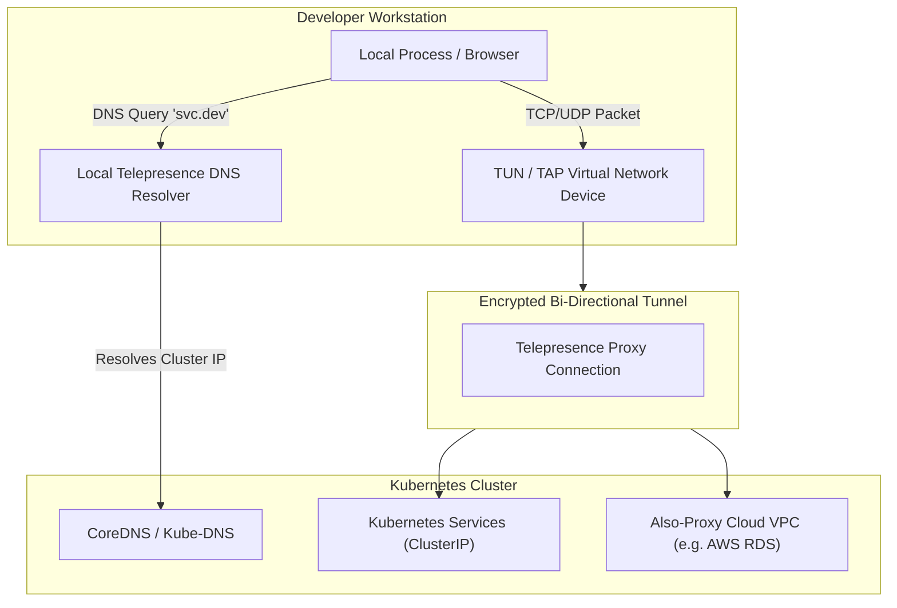

# Advanced Network & Subnet Routing

The **Network** tab provides granular control over how Telepresence establishes tunnels, resolves DNS names, and routes network packets between your workstation and the remote cluster.

---

## 🌐 Network Configuration Fields

```
+-------------------------------------------------------------------------+
| Mapped Namespaces:         [ dev,staging,shared-db                   ]  |
| Also-Proxy CIDRs:          [ 10.244.0.0/16, 172.20.0.0/16            ]  |
| Never-Proxy CIDRs:         [ 192.168.1.0/24                          ]  |
| Reroute Local:             [ 8080:80                                 ]  |
| Reroute Remote:            [ 9090:9090                               ]  |
| Virtual NAT (vNAT):        [ 10.100.0.0/16                           ]  |
| Allow Conflicting Subnets: [ 10.0.0.0/8                              ]  |
| Expose Ports:              [ 3000,5000                               ]  |
| Custom Hostname:           [ my-dev-station.cluster.local            ]  |
+-------------------------------------------------------------------------+
```

---

## 🔍 Detailed Field Breakdown

### 1. Mapped Namespaces (`--mapped-namespaces`)
Controls which Kubernetes namespaces have their internal DNS records resolved on your local workstation.
- **Default**: Only the target namespace.
- **Comma-Separated List**: e.g., `default,auth,billing,databases`.
- **Usage**: Allows your local workstation to reach `service-name.namespace` (e.g., `curl http://redis.shared-db:6379`) as if you were running inside the cluster.

---

### 2. Also-Proxy Subnets (`--also-proxy`)
Specifies additional IPv4/IPv6 CIDR blocks that should be routed through the cluster network tunnel.
- **Usage**: When your cluster connects to external cloud databases (e.g., AWS RDS, GCP Cloud SQL, or corporate on-premise VPCs) that are not part of standard Kubernetes Service CIDRs.
- **Example**: `10.50.0.0/16, 172.31.0.0/16`.

---

### 3. Never-Proxy Subnets (`--never-proxy`)
Specifies CIDRs that must **never** be routed through the cluster, preserving direct local network access.
- **Usage**: Prevents Telepresence from overriding your local LAN, home router subnet (`192.168.1.0/24`), or local corporate VPN tunnels.
- **Example**: `192.168.0.0/16, 127.0.0.0/8`.

---

### 4. Reroute Local & Remote (`--reroute-local`, `--reroute-remote`)
- **Reroute Local**: Reroutes connections destined for a remote cluster port to a local port on your workstation.
  - *Format*: `localPort:remotePort` (e.g., `8080:80`).
- **Reroute Remote**: Reroutes connections initiated locally to a specific remote service/port in the cluster.

---

### 5. Virtual NAT (`--vnat`)
Configures a Virtual Network Address Translation subnet when there is an IP collision between your local workstation network and the Kubernetes pod/service network.
- **Format**: CIDR range (e.g., `10.200.0.0/16`).
- **How it works**: Telepresence maps cluster IP addresses into this virtual subnet so you can access remote services without conflicting with local LAN IPs.

---

### 6. Allow Conflicting Subnets (`--allow-conflicting-subnets`)
Overrides safety checks when a cluster subnet overlaps with a locally connected network interface.
- Use with caution to force traffic routing through the cluster tunnel.

---

### 7. Expose Ports & Custom Hostname (`--expose`, `--hostname`)
- **Expose Ports (`--expose`)**: Comma-separated list of ports on your workstation that cluster workloads should be able to access.
- **Custom Hostname (`--hostname`)**: Custom DNS name assigned to your local workstation within the cluster network (e.g., `developer-laptop.cluster.local`).

---

## 📊 Network Packet Flow Diagram


